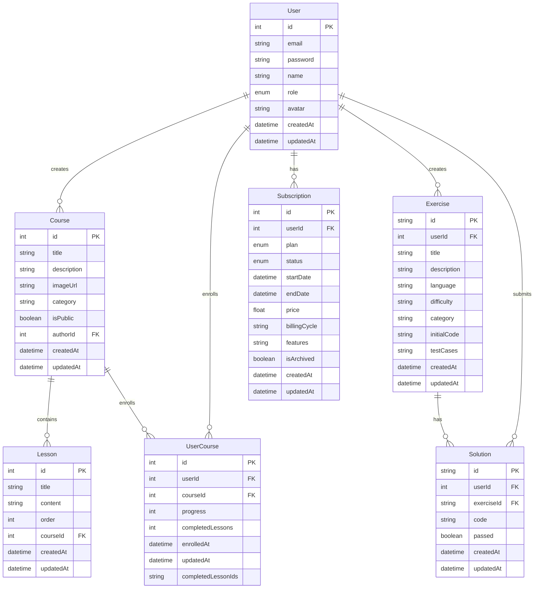

# LearnMore - Interactive Course Creation Platform

## Overview and Key Features

LearnMore is a SaaS web application designed for creating and managing online courses. The target audience includes educators, trainers, educational institutions, and companies looking to develop and share educational content. The application is built using Next.js framework with PostgreSQL database backend.

The platform may develop native mobile applications in the future to enhance accessibility and user experience.

Key features of LearnMore include:

- **Course Creation and Management**: Intuitive interface for creating multipage courses with media integration
- **QR Code Generation**: Generate printable sheets with QR codes linked to courses for easy sharing
- **Progress Tracking**: Dashboard for educators to monitor learner progress
- **Interactive Navigation**: User-friendly interface that tracks progress and completion status
- **Assessment Tools**: Quiz functionality with various question types embedded throughout courses
- **Programming Education**: Browser-based coding exercises for Python and JavaScript with automated grading
- **Subscription Management**: Tiered subscription plans with different feature sets

## Database Design

The database is designed to support all the core functionalities of the LearnMore platform. Below is a description of the main entities and their relationships:

### User Management
- Users can have different roles (STUDENT, EDUCATOR)
- Educators can create courses, while students can enroll in courses
- User information includes email, password, name, role, and avatar

### Course Structure
- Courses have title, description, image, category, and visibility settings
- Courses contain multiple lessons in a specific order
- Course enrollment tracks user progress, including completed lessons

### Learning Activities
- Programming exercises with different difficulty levels and languages
- User solutions are tracked and evaluated for correctness

### Subscription System
- Multiple subscription plans (BASIC, STANDARD, PREMIUM, ENTERPRISE)
- Tracking of subscription status, billing cycle, and features

### Entity Relationship Diagram

## Mockups

- **Home**

  

- Courses Overview 

  

- Course Details:

  

- Etc... See our website: https://learn-more-lovat.vercel.app/

## Technical Research

The following table compares the technologies considered for implementing the code editor and execution environment for programming exercises:

| Feature | Monaco Editor | CodeMirror | Ace Editor |
|---------|--------------|------------|------------|
| Syntax Highlighting | Excellent support for multiple languages | Good support for many languages | Good support for many languages |
| Code Completion | Built-in intelligent suggestions | Basic completion available | Basic completion available |
| React Integration | Well-supported | Well-supported | Well-supported |
| Mobile Responsiveness | Moderate | Good | Moderate |
| Performance | Heavier but powerful | Lightweight | Middle-ground |
| Community Support | Very active | Active | Moderate |
| Cost | Free, open-source | Free, open-source | Free, open-source |
| Ease of Implementation | Moderate | Easy | Moderate |

**Decision**: Monaco Editor was selected for the project due to its comprehensive syntax highlighting, intelligent code completion features, and active community support. Despite being slightly heavier than alternatives, its benefits for programming education outweigh this limitation.

## Accessibility

LearnMore is designed with accessibility in mind to ensure all users can access and use the platform effectively. Key accessibility features include:

- Semantic HTML structure for screen reader compatibility
- Keyboard navigation support throughout the application
- Color contrast compliance with WCAG 2.1 guidelines
- Alt text for all images and descriptive labels for interactive elements
- Responsive design to accommodate different device sizes and zoom levels
- ARIA attributes for complex interactive components
- Focus management for modal dialogs and form elements

## References

1. Next.js Documentation. https://nextjs.org/docs
2. Prisma Documentation. https://www.prisma.io/docs
3. Monaco Editor. https://microsoft.github.io/monaco-editor/
4. Pyodide: Python in the Browser. https://pyodide.org/en/stable/
5. Mermaid Diagram Syntax. https://mermaid.js.org/

**AI Tools Used**:
- ChatGPT is used to assist in code review and generating unit test cases
- Diagram.io was used for visualizing and refining the database relationships before implementing the Mermaid diagram
